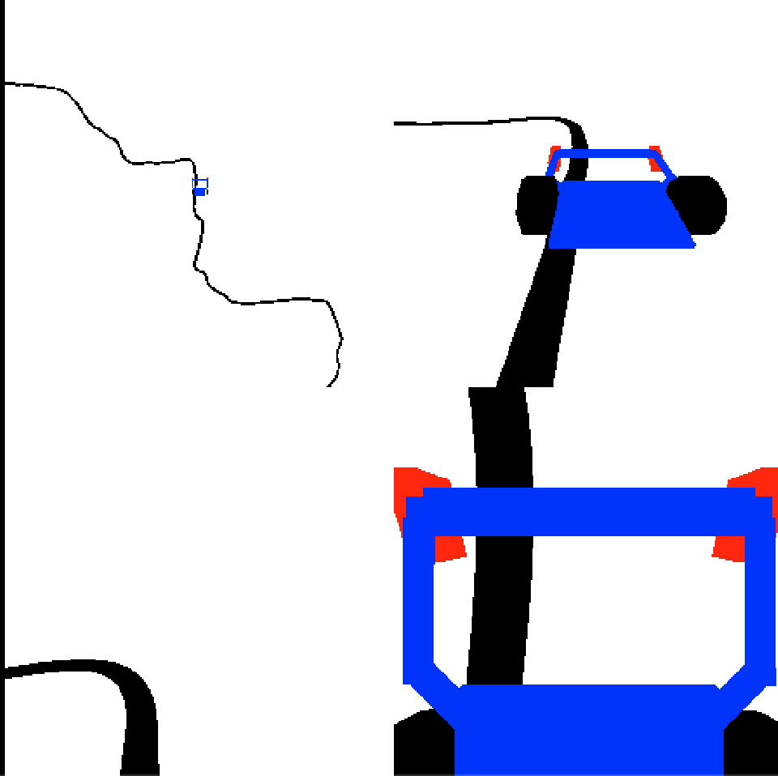

# Line Follower reinforcement learning evironment

### Observation
camera view from front of robot
- state : 4stacked grayscale frames, channels first, 4x96x96
- values float range <0.0, 1.0>

### Actions
discrete, 16 actions - powers to motors

### Reward
- +1 : for new path visited field, if more than 90% fields visited, episode done
- -1 : if more than 150mm away from line, episode ends
- small negative reward : for line position not in center

## Getting Started

#### TODO example

### Prerequisites

numpy, gym, pybullet, cv2

### Installing

#### TODO not workking yet
pip3 install -e .