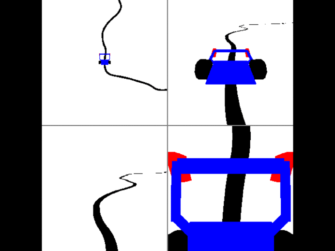

# Line Follower reinforcement learning environment




### Observation
camera view from front of robot
- state : 4stacked grayscale frames, channels first, 4x96x96
- values float range <0.0, 1.0>

### TODO and bugs
- random lines
- remove rendering glitches !!!


### Actions
discrete, 16 actions - powers to motors


### Reward
- +1 : for new path visited field, if more than 90% fields visited, episode done
- -1 : if more than 150mm away from line, episode ends
- small negative reward : for line position not in center

## Getting Started

#### random agent :

```python
import gym
import gym_linefollower

env = gym.make('linefollower-v0')

env.reset()
    
while True:
    action = env.action_space.sample()
    state, reward, done, _ = env.step(action)
    env.render()
		
    if done:
        env.reset()
```

### Prerequisites

numpy, gym, pybullet, opencv-python

### Installing

```bash
pip3 install -e .
```